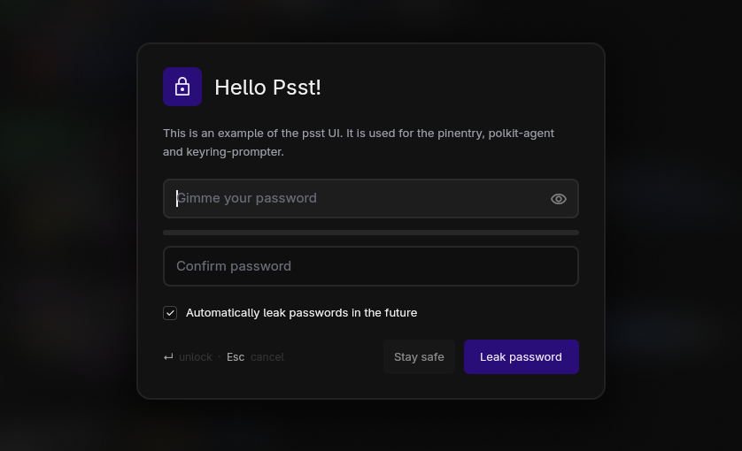
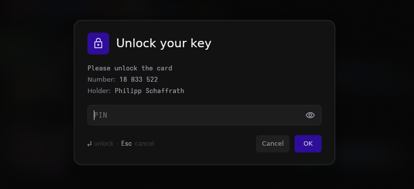
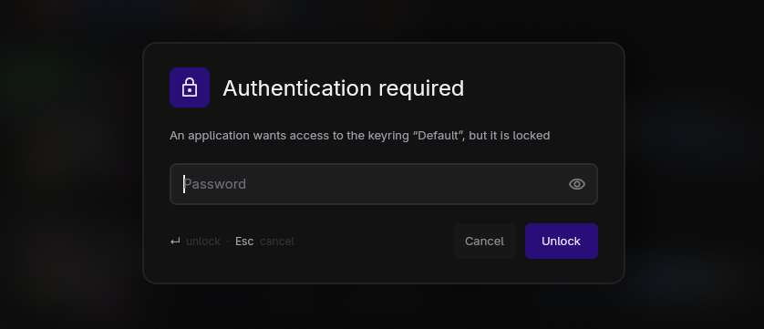
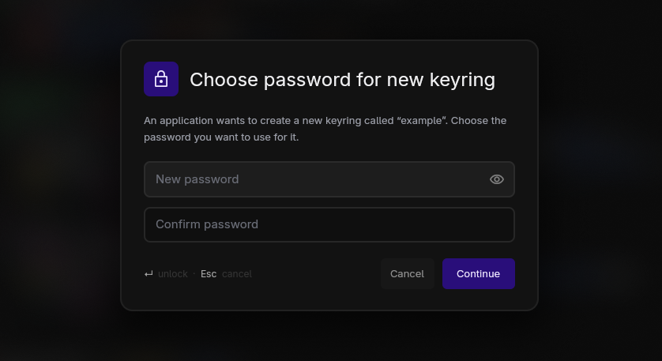
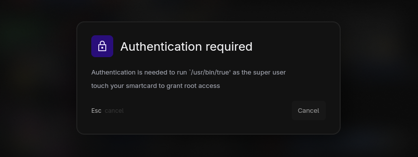

# Psst

A not-so-ugly replacement for your pinentry and keyring prompter for wayland using a layer-shell overlay.
Supports [pinentry](#Pinentry), [keyring prompter](#Keyring-prompter), and [polkit-agent](#Polkit-agent) authentication.



## Setup

Build the programs:

```sh
cargo build --release
```

All binaries land in `target/release/`.


### Pinentry

Allows `gpg-agent` to ask for your key passphrase or smartcard PIN via `psst-pinentry`.

Update your `~/.gnupg/gpg-agent.conf` configuration to use `psst-pinentry` as your pinentry program by adding the following line:

```sh
pinentry-program /absolute/path/to/psst/binary/psst-pinentry
```

> [!NOTE]
> Make sure to replace `/absolute/path/to/psst/binary/psst-pinentry` with the actual path to the `psst-pinentry` binary on your system. This path depends on where your package manager installs the binary. Typically, it's installed in `/usr/bin/`.



### Keyring Prompter

Allows your keyring to ask for a password when unlocking, or a new password when creating a new keyring. Takes over keyring unlock prompts for as long as it's running.

To use `psst-keyring-prompter`, add the following to your compositor's autostart:

```sh
psst-keyring-prompter
```




### Polkit Agent

Allows applications to request elevated permissions. Registers as the authentication agent for your session and stays running. The prompt follows your polkit PAM stack (`/etc/pam.d/polkit-1`): it asks for a password, or just waits for a hardware-key touch, depending on how authentication is configured.

To use `psst-polkit-agent`, add the following to your compositor's autostart:

```sh
psst-polkit-agent
```



## Theming

Every color, font, size, border, and radius is themeable through a [KDL](https://kdl.dev) file at `~/.config/psst/theme.kdl` (or `$XDG_CONFIG_HOME/psst/theme.kdl`). Anything you omit keeps its default, and an invalid theme is ignored with a warning rather than blocking a prompt.

The [`default-theme.kdl`](crates/theme/src/default-theme.kdl) file is the default theme implementation, copy it to `~/.config/psst/theme.kdl` (or overwrite specific values in a new file) and edit to taste.

## License

[MPL-2.0](LICENSE). You can use psst in anything, but if you redistribute the
covered files (modified or not), their source must stay open under the MPL.
