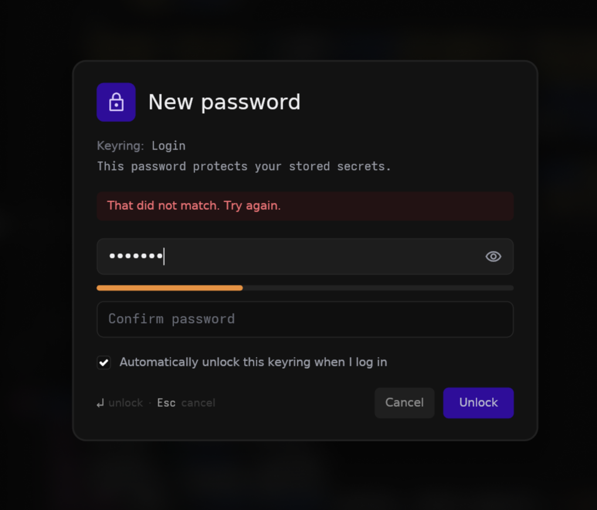
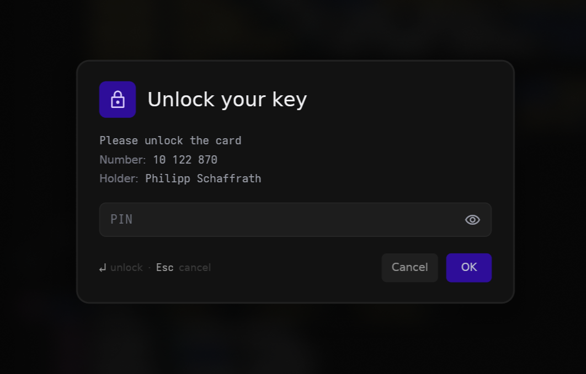
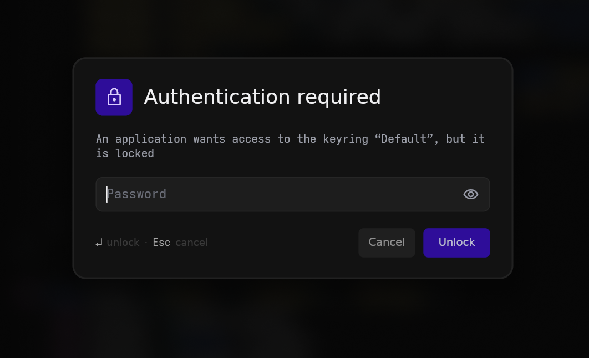
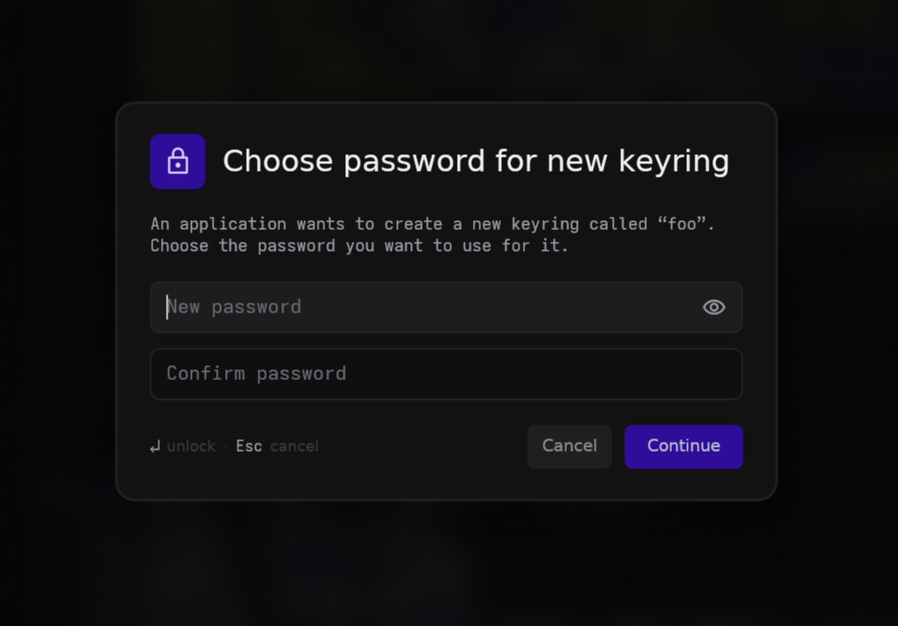

# Psst

A not-so-ugly replacement for your pinentry and keyring prompter for wayland using a layer-shell overlay.

<p align="center">
  
</p>

Psst provides:

- **`psst-pinentry`**: the dialog GnuPG uses to ask for your key passphrase or smartcard PIN (a *pinentry* program for `gpg-agent`).
- **`psst-keyring-prompter`**: the dialog that unlocks your GNOME keyring, replacing the default gnome keyring prompt.
- **`psst-polkit-agent`**: a polkit authentication agent, for the "authentication required" prompts when an app needs elevated privileges (password or a hardware-key touch, whatever your PAM stack asks for).

## Setup

Build the programs:

```sh
cargo build --release
```

All binaries land in `target/release/`.


### GnuPG

Update your `gpg-agent` configuration to use `psst-pinentry` as your pinentry program. To do that, add the following to `~/.gnupg/gpg-agent.conf`:

```sh
pinentry-program /path/to/psst/target/release/psst-pinentry
```

<p align="center">
  
</p>

### GNOME Keyring

To use `psst-keyring-prompter`, add the following to your compositor's autostart:

```sh
psst-keyring-prompter
```

and reload your agent:

```sh
gpg-connect-agent reloadagent /bye
```

It takes over keyring unlock prompts for as long as it's running.

<p align="center">
  
  
</p>

### polkit

To handle "authentication required" prompts, run the agent from your compositor's autostart:

```sh
psst-polkit-agent
```

It registers as the authentication agent for your session and stays running. The prompt follows your polkit PAM stack (`/etc/pam.d/polkit-1`): it asks for a password, or just waits for a hardware-key touch, depending on how authentication is configured.

## Theming

Every color, font, size, border, and radius is themeable through a [KDL](https://kdl.dev) file at `~/.config/psst/theme.kdl` (or `$XDG_CONFIG_HOME/psst/theme.kdl`). Anything you omit keeps its default, and an invalid theme is ignored with a warning rather than blocking a prompt.

The [`default-theme.kdl`](crates/theme/src/default-theme.kdl) file lists every available
option at its default value, copy it to `~/.config/psst/theme.kdl` and edit to taste.

## License

[MPL-2.0](LICENSE). You can use psst in anything, but if you redistribute the
covered files (modified or not), their source must stay open under the MPL.
